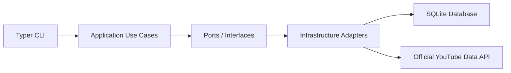
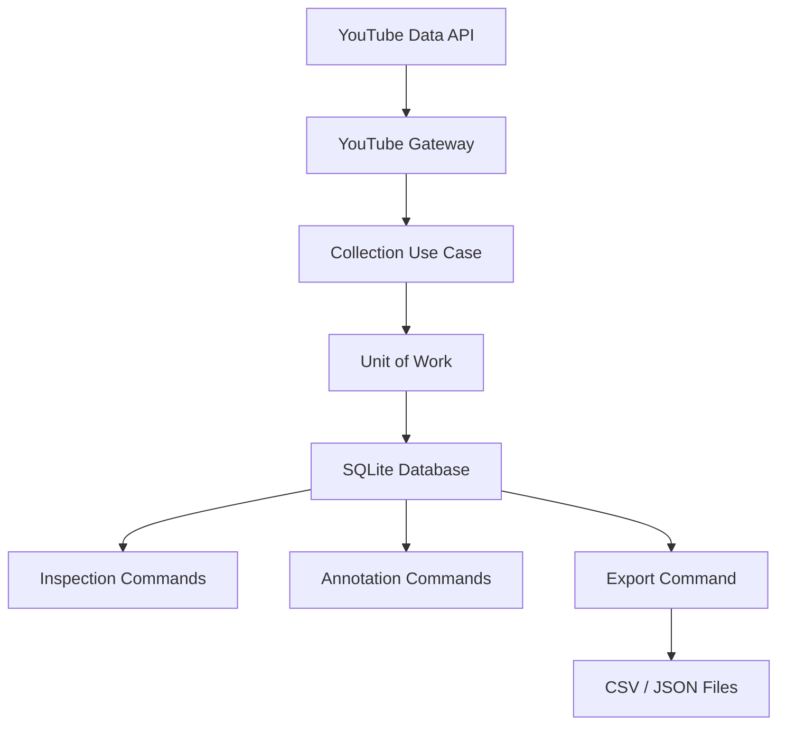

# Fencing Video Research Agent

A Python 3.12 Phase 1 backend and research-data foundation for reproducible public
fencing-video metadata collection.

The current implementation focuses on sabre-related YouTube metadata collected
through the official YouTube Data API. It stores local research data in SQLite,
preserves search provenance, supports manual annotation, and exports video-level
and search-hit-level CSV/JSON datasets for later analysis and provenance auditing.

Implementation state: through Milestone 10A.

## Table of Contents

- [Project Overview](#project-overview)
- [Current Capabilities](#current-capabilities)
- [What This Project Does Not Do Yet](#what-this-project-does-not-do-yet)
- [Architecture Overview](#architecture-overview)
- [Data Flow](#data-flow)
- [Tech Stack](#tech-stack)
- [Repository Structure](#repository-structure)
- [Installation](#installation)
- [Environment Setup](#environment-setup)
- [Quick Start Demo](#quick-start-demo)
- [CLI Commands](#cli-commands)
- [Data Model Summary](#data-model-summary)
- [Research Workflow](#research-workflow)
- [Export Workflow](#export-workflow)
- [Testing and Validation](#testing-and-validation)
- [Security and Data Policy](#security-and-data-policy)
- [Documentation](#documentation)
- [Roadmap](#roadmap)
- [Project Status](#project-status)

## Project Overview

Public fencing videos, especially sabre bouts, are useful for future sports-video
research. The first research challenge is not computer vision; it is collecting and
organizing reliable metadata about what videos were found, which search terms found
them, and when the collection happened.

This project turns that early research step into a reproducible workflow. It searches
YouTube through the official YouTube Data API, stores public video metadata in a local
relational database, records collection runs and search-hit relationships, supports
manual researcher review, and exports selected data to CSV or JSON.

The project is intentionally a Phase 1 metadata and organization system. It is built
so later work can add richer annotations, larger collection protocols, analysis, or
video-AI experiments on top of a documented data foundation.

## Current Capabilities

| Capability | Command/Feature | Status |
| --- | --- | --- |
| Collect YouTube metadata | `collect` | Implemented |
| Store videos and latest metadata | SQLite, SQLAlchemy, Alembic | Implemented |
| Preserve search query provenance | `search_queries`, `collection_runs`, `search_hits` | Implemented |
| Inspect stored videos | `videos list`, `videos show` | Implemented |
| Inspect collection runs | `runs list`, `runs show` | Implemented |
| Manually annotate stored videos | `annotations show`, `set-status`, `set-notes`, `set-label`, `clear-label` | Implemented |
| Export video-level CSV/JSON datasets | `export videos --format csv\|json` | Implemented |
| Export search-hit provenance CSV/JSON datasets | `export search-hits --format csv\|json` | Implemented |
| Run offline automated tests | `pytest`, Ruff, mypy | Implemented |

## What This Project Does Not Do Yet

| Area | Current Status |
| --- | --- |
| Video downloading | Not implemented |
| Computer vision | Not implemented |
| Scoring detection | Not implemented |
| Event detection | Not implemented |
| Frontend UI | Not implemented |
| Model training | Not implemented |
| PostgreSQL deployment | Not implemented yet |
| Scientific conclusions from the smoke test | Not claimed |

The current real smoke test is intentionally small. It validates the workflow, but it
is not a large scientific dataset.

## Architecture Overview

The project follows a lightweight clean architecture. The domain and application
layers stay independent of SQLAlchemy, Google API clients, Typer, pandas, and local
environment details.



| Layer | Responsibility |
| --- | --- |
| Domain | Framework-free research concepts such as videos, metadata, search queries, collection runs, and annotations |
| Application | Use cases for collection, inspection, annotation, and export |
| Ports | Project-owned interfaces for gateways, repositories, readers, writers, clocks, and Unit of Work |
| Infrastructure | Concrete SQLAlchemy, Alembic, SQLite, YouTube API, settings, and pandas export implementations |
| Interface/CLI | Typer commands, argument parsing, user-facing output, and safe exit codes |
| Bootstrap | Composition root that wires settings, adapters, repositories, and use cases |

## Data Flow



Collection is the only workflow that calls the YouTube Data API. Inspection,
annotation, and export read or write only the local SQLite database.

## Tech Stack

| Technology | Used For | Why It Matters |
| --- | --- | --- |
| Python 3.12 | Main language | Modern, readable backend and research tooling |
| Typer | Command-line interface | Clear, testable CLI commands |
| SQLAlchemy 2.x | ORM and persistence mapping | Organized database access while keeping ORM code in infrastructure |
| Alembic | Database migrations | Auditable schema evolution |
| SQLite | Phase 1 database | Simple local storage for reproducible early research workflows |
| pandas | CSV/JSON export processing | Analysis-friendly tabular export |
| Pydantic Settings | Configuration loading and validation | Centralized environment-based settings |
| `google-api-python-client` | Official YouTube Data API access | Uses the official API instead of webpage scraping |
| pytest | Automated tests | Offline deterministic validation |
| Ruff | Linting and formatting checks | Consistent code quality |
| mypy | Static typing | Type-safety checks for the source package |
| `python-dotenv` / settings loading support | Local `.env` loading | Keeps machine-specific configuration outside source code |

## Repository Structure

| Path | Purpose |
| --- | --- |
| `src/fencing_video_research_agent/domain` | Framework-free domain models and enums |
| `src/fencing_video_research_agent/application` | Use cases for collection, inspection, annotation, and export |
| `src/fencing_video_research_agent/ports` | Interfaces for external boundaries and replacement points |
| `src/fencing_video_research_agent/infrastructure` | SQLAlchemy, Alembic, YouTube API, settings, and pandas export implementations |
| `src/fencing_video_research_agent/interface` | Typer CLI entry point |
| `alembic` | Database migration environment and revisions |
| `tests` | Offline deterministic test suite |
| `docs/decisions` | Architecture Decision Records |
| `docs/research` | Research report and project-facing research documentation |
| `data/exports` | Default generated export location; generated files are ignored by Git |
| `.env.example` | Placeholder environment configuration |
| `pyproject.toml` | Package metadata, dependencies, CLI entry point, and tool configuration |
| `AGENTS.md` | Repository engineering rules for coding agents |

## Installation

From the repository root on Windows PowerShell:

```powershell
py -3.12 -m venv .venv
.\.venv\Scripts\python.exe -m pip install -e ".[dev]"
fencing-video-research-agent --help
```

If the console script is not on your current shell path yet, run it through the
virtual environment:

```powershell
.\.venv\Scripts\fencing-video-research-agent.exe --help
```

The package entry point is defined in `pyproject.toml`.

## Environment Setup

Create a local `.env` file from `.env.example`:

```powershell
Copy-Item .env.example .env
```

Then edit `.env` locally:

```text
YOUTUBE_API_KEY=replace_with_your_api_key
DATABASE_URL=sqlite:///data/fencing_video_research.db
LOG_LEVEL=INFO
```

Important rules:

- Put the real YouTube API key only in `.env`.
- Never commit `.env`.
- Never paste real API keys into chat, documentation, GitHub issues, screenshots, or
  logs.
- `DATABASE_URL` defaults to a local SQLite database path.
- `collect` requires `YOUTUBE_API_KEY`.
- Read-only inspection, annotation, and export commands do not require
  `YOUTUBE_API_KEY`.

## Quick Start Demo

This is a small end-to-end workflow for local validation. It intentionally caps the
collection size to limit YouTube API quota use.

```powershell
fencing-video-research-agent collect "sabre fencing final" --max-results 5
fencing-video-research-agent videos list
fencing-video-research-agent runs list
fencing-video-research-agent annotations set-status <youtube_video_id> reviewed
fencing-video-research-agent annotations set-notes <youtube_video_id> --notes "Useful sabre bout."
fencing-video-research-agent export videos --format csv --overwrite
fencing-video-research-agent export search-hits --format csv --overwrite
```

Do not put a real API key in the command line. The API key belongs only in `.env`.

## CLI Commands

| Command | Purpose | Requires YouTube API Key? |
| --- | --- | --- |
| `collect <query>` | Search YouTube and store metadata plus provenance | Yes |
| `videos list` | List videos already stored in the local database | No |
| `videos show <youtube_video_id>` | Show details for one stored video | No |
| `runs list` | List previous collection runs | No |
| `runs show <run_id>` | Show query, timing, parameters, and returned videos for one run | No |
| `annotations show <youtube_video_id>` | Show local researcher annotation fields | No |
| `annotations set-status <youtube_video_id> <status>` | Set review status to `unreviewed` or `reviewed` | No |
| `annotations set-notes <youtube_video_id> --notes "..."` | Store manual researcher notes | No |
| `annotations set-label <youtube_video_id> <label>` | Store one relevance label | No |
| `annotations clear-label <youtube_video_id>` | Clear the relevance label | No |
| `export videos` | Export one row per stored video to CSV or JSON | No |
| `export search-hits` | Export one row per search-hit provenance relationship to CSV or JSON | No |

## Data Model Summary

| Table | Purpose |
| --- | --- |
| `videos` | Stores one row per known public YouTube video and its first-seen timestamp |
| `youtube_video_metadata` | Stores latest YouTube-owned metadata for each video |
| `search_queries` | Stores search text and project-owned search parameters |
| `collection_runs` | Stores each attempt to collect metadata for a search query |
| `search_hits` | Links collection runs to the videos returned by that run |
| `research_annotations` | Stores researcher-owned review fields separately from YouTube metadata |

The central provenance relationship is:

```text
search_queries -> collection_runs -> search_hits -> videos
```

This relationship preserves how each stored video was discovered. Research annotations
remain separate from YouTube metadata so metadata refreshes do not overwrite manual
review work.

## Research Workflow

The current Phase 1 workflow is:

```text
collect -> inspect -> review/annotate -> export
```

1. Collect a small, controlled search through the official YouTube Data API.
2. Inspect stored videos and collection runs locally.
3. Review and annotate videos already in the database.
4. Export video-level records for analysis or reporting.

## Export Workflow

Use `export videos` to write one row per stored video:

```powershell
fencing-video-research-agent export videos
fencing-video-research-agent export videos --format json
fencing-video-research-agent export videos --output data/exports/custom-videos.csv
fencing-video-research-agent export videos --format csv --overwrite
```

Export behavior:

- `--format csv|json` selects the export format.
- `--output PATH` overrides the default output path.
- `--overwrite` replaces an existing export file.
- Default CSV output: `data/exports/videos.csv`.
- Default JSON output: `data/exports/videos.json`.
- Generated exports are ignored by Git.
- Each export row represents one stored video.
- Exported records include YouTube metadata, annotation fields, and compact
  provenance summary fields.
- Export commands do not call YouTube and do not require `YOUTUBE_API_KEY`.

Use `export search-hits` to write one row per search-hit relationship:

```powershell
fencing-video-research-agent export search-hits
fencing-video-research-agent export search-hits --format json
fencing-video-research-agent export search-hits --output data/exports/custom-search-hits.csv
fencing-video-research-agent export search-hits --format csv --overwrite
```

Search-hit export behavior:

- Default CSV output: `data/exports/search_hits.csv`.
- Default JSON output: `data/exports/search_hits.json`.
- Each export row represents one search hit, not one video.
- Repeated videos across multiple collection runs appear as multiple rows.
- Exported records include query text, query parameters, run timing/status, hit rank,
  video identity, useful metadata, and compact annotation summary fields.
- CSV encodes `query_parameters` as a JSON string; JSON keeps it as an object.
- Long annotation notes are intentionally not included in this provenance export.

## Testing and Validation

Normal automated tests are offline and deterministic. They use fake ports, fabricated
API responses, temporary SQLite databases, and fixed clocks where needed. Real YouTube
API usage is manual smoke testing only.

Run the full validation suite:

```powershell
.\.venv\Scripts\python.exe -m pytest
.\.venv\Scripts\python.exe -m ruff check .
.\.venv\Scripts\python.exe -m ruff format --check .
.\.venv\Scripts\python.exe -m mypy src
```

Architecture boundary scan:

```powershell
rg -n "googleapiclient|sqlalchemy|alembic|YOUTUBE_API_KEY|dotenv|os\.environ" src\fencing_video_research_agent\application src\fencing_video_research_agent\domain
```

The boundary scan should return no matches for the application and domain layers.

## Security and Data Policy

- `.env` is ignored by Git.
- Local database files such as `*.db`, `*.sqlite`, and `*.sqlite3` are ignored.
- Generated exports under `data/exports/` are ignored except for `.gitkeep`.
- API keys must not be committed, printed, logged, or placed in documentation.
- The project uses the official YouTube Data API only.
- The project does not scrape YouTube webpages.
- The project collects public metadata only.
- Automated tests do not call the live YouTube API.
- Manual smoke tests should stay small to limit quota use.

## Documentation

| Document | Purpose |
| --- | --- |
| [`docs/research/research-report.md`](docs/research/research-report.md) | Professor-facing research report through Milestone 8 |
| [`docs/manual-smoke-test.md`](docs/manual-smoke-test.md) | Safe manual procedure for one small real-API smoke test |
| [`docs/data-model.md`](docs/data-model.md) | Phase 1 database schema and provenance explanation |
| [`docs/decisions/`](docs/decisions/) | Architecture Decision Records |

## Roadmap

| Stage | Future Work |
| --- | --- |
| Current documentation milestone | README and demo polish |
| Current export milestone | Search-hit/provenance export as a separate dataset contract |
| Near term | Richer annotation protocol if the research method needs it |
| Medium term | Larger controlled collection protocol for sabre-related searches |
| Medium term | Frontend or dashboard after backend behavior remains stable |
| Medium term | PostgreSQL as a later optional persistence target |
| Long term | Computer vision or event-detection experiments on top of curated metadata |

## Project Status

The project is a Phase 1 backend and research-data foundation implemented through
Milestone 8. It is suitable for continued research-software development, professor
review, and future dataset-building work.

It is not yet a full AI or video-analysis system. It does not detect fencing actions,
analyze video content, train models, or claim scientific conclusions from the small
manual smoke test.
